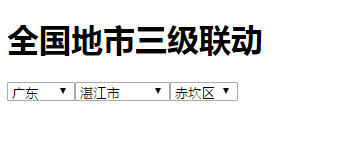

[TOC]

# Ajax

## 课程目标
* 了解http请求，搞懂请求与响应
* 掌握ajax请求的发送及数据处理
* 掌握同步操作与异步操作
* 理解Promise对象及常用方法的使用
* 学会查看接口文档
* 学会处理后端返回数据

## 了解AJAX
* AJAX: Asynchronous Javascript And Xml，Ajax 技术的核心是`XMLHttpRequest`对象（简称**xhr**），这是由微软首先引入的一个特性，最早出现在2005年的google搜索建议，下是ajax的出现让javascript这门语言的发展进入到另一阶段

* ajax优点
    - 按需加载：减轻服务器的负担,按需加载数据,最大程度的减少冗余请求
    - 改善的用户体验：局部刷新页面,减少用户等待时间,带来更好的用户体验
    - 前后端分离：页面和数据分离，分工操作更灵活，后期维护更方便

* 应用：通过ajax请求向服务器请求数据，然后根据数据在前端生成页面结构并渲染
    > 

## AJAX请求步骤
1. 创建请求对象
    ```js
        var xhr = new XMLHttpRequest();
    ```
2. 设置请求参数，建立与服务器连接
    ```js
        xhr.open("get", "http://localhost/api/ajaxtest", true);
    ```
3. 向服务器发送请求
    ```js
        xhr.send(null);
    ```
4. 处理服务器响应数据
    > ajax请求为异步操作，需要通过事件来处理服务器返回的数据
    * onreadystatechange
    * onload

    ```javascript
        xhr.onreadystatechange = function(){
            if(xhr.readyState == 4) {
                console(xhr.responseText);
            }
        }
        xhr.onload = function(){
            console(xhr.responseText);
        }
    ```
        
## xhr对象属性&方法
* `open(type,url,async)`: 建立与服务器的连接
    - type：请求的类型
        * get
        * post
        * put/patch
        * delete
        * ...
    - url：数据请求的地址（API地址，接口地址），一般由后端开发人员提供
        > 注意：按照同源策略的要求，当前页面地址与API地址必须**同域**
        * 同域：协议，域名，端口三者一致，否则为跨域
            > 默认不允许跨域请求，除非服务器允许

    - async：是否异步发送请求，默认为true
        > 如果请求时间长，用户需要等待很长的时间才能看到效果，一般很少使用同步请求（async:false）
        * **同步**：按步骤顺序执行，前面的代码执行完后，才会执行后面的代码（会阻塞代码的执行）
        * **异步**：异步代码执行时不等待结果，继续执行其他代码的操作
            * 图片加载
            * ajax请求
            * 定时器

* `send(data)`: 向服务器发送请求
    - data：可选参数，表示通过请求体发送数据到后端
    ```javascript
        xhr.send('size=20&type=music');
    ```
    
    - get请求的数据写在api地址后
    ```js
        xhr.open("get", "http://localhost/api/getdata.php?type=get&qty=10", true);
    ```

* `setRequestHeader(key,val)`：设置请求头
    > 注意：设置请求头必须在open方法调用后调用
    * 利用请求头设置发磅数据格式
        * `application/x-www-form-urlencoded`
        * `application/json`
        * `text/plain`（默认）
        ```js
            xhr.setRequestHeader('Content-Type',"application/x-www-form-urlencoded");
        ```

* readyState
    - 0 － （未初始化）尚未调用open()方法。
    - 1 － （启动）已经调用open()方法，但尚未调用send()方法。
    - 2 － （发送）send()方法执行完成，但尚未接收到响应。
    - 3 － （接收）已经接收到部分响应数据。
    - 4 － （完成）响应内容解析完成，可以在客户端调用了

    >只要readyState 属性的值由一个值变成另一个值，都会触发一次`readystatechange` 事件。因此必须在调用`open()`之前指定`onreadystatechange`事件处理程序才能捕获到值的改变。

* `responseText`：保存服务器返回的数据（从服务器返回的数据是“**字符串**”）。
* `status`：响应的HTTP 状态。
    - 200（OK）：服务器成功返回了页面
    - 304（Not Modified）：数据与服务器相同，不需要重服务器请求（直接使用缓存的数据）
    - 400（Bad Request）：语法错误导致服务器不识别
    - 401（Unauthorized）：请求需要用户认证
    - 404（Not found）：请求地址不存在
    - 500（Internal Server Error）：服务器出错或无响应
    - 503（ServiceUnavailable）：由于服务器过载或维护导致无法完成请求


## JSON数据的应用
* xml数据（了解）
    > 通过节点操作的方式获取xml中的数据
    ```xml
        <person>
            <id>4564523626256562</id>
            <name>张三</name>
        </person>
    ```

* json数据
    > 符合json规范的数据称为json数据（json字符串与json对象）
    * json数据格式要求
    * 转换
        * json字符串->js对象：`JSON.parse()`
        * js对象->json字符串：`JSON.stringify()`
    * mock数据：ajax直接请求json文件
        > 前后端分离开发时的模拟数据操作


## ajax封装
> 简化用户操作，提高利用率，提升代码可维护性
```js
    function request(){
        // ajax代码
    }
```


## Promise
Promise是ES6推出的新特性，所谓的Promise对象，就是通过new Promise()实例化得到的对象，用来传递异步操作的消息。它代表了某个未来才会知道结果的事件（通常是一个异步操作），并且这个事件提供统一的 API，可供进一步处理。

### Promise 的三种状态
* Pending（未完成）可以理解为Promise对象实例创建时候的初始状态
* Fulfilled（成功） 可以理解为成功的状态
* Rejected（失败） 可以理解为失败的状态

### 方法
* 静态方法
    * `Promise.resolve()`
        > 创建一个Promise对象，并将它的状态改成Fulfilled
        ```javascript
            var p = Promise.resolve('foo');

            // 等价于
            var p = new Promise(resolve => resolve('foo'));
        ```
    * `Promise.reject()`
        > 创建一个Promise对象，该实例的状态为rejected
    * `Promise.all([p1,p2,p3...])` 
        > 将多个Promise实例，包装成一个新的Promise实例
        - 所有参数中的promise状态都为Fulfilled是，新的promise状态才为Fulfilled
        - 只要p1、p2、p3..之中有一个被rejected，新的promise的状态就变成rejected
    * `Promise.race([p1,p2,p3...])` 
        > 竞速，谁跑的快，以谁为准执行回调
        ```js
            // 请求一张图片，成功则显示图片，如果5s图片还没有返回，则提示请求超时
            function requestImg(){
                return new Promise((resolve, reject)=>{
                    var img = new Image();
                    img.onload = function(){
                        resolve(img);
                    }
                    img.src = 'laoxie.jpg';
                });
            }

            //延时函数，用于给请求计时
            function timeout(){
                return Promise((resolve, reject)=>{
                    setTimeout(()=>{
                        reject('图片请求超时');
                    }, 5000);
                });
            }

            Promise.race([requestImg(), timeout()])
            .then(function(result){
                document.body.appendChild(result)
            })
            .catch(function(reason){
                console.log(reason);
            });
        ```

* 原型方法
    * `Promise.prototype.then(successFn[,failFn])`
        > Promise实例生成以后，可以用then方法分别指定Fulfilled状态和Rejected状态的回调函数。并根据Promise对象的状态来确定执行的操作:
        - Fulfilled时执行第一个函数successFn
        - rejected时执行第二个函数failFn。
    * `Promise.prototype.catch(failFn)`
        > 等效于then方法中的第二个参数，好处是当successFn中抛出错误时不会导致程序崩溃，而是会进行catch方法

### 使用
Promise的构造函数接收一个回调函数作为参数，并且传入两个参数：resolve，reject，分别表示异步操作执行成功和失败后的回调函数

```javascript
    var p = new Promise(function(resolve, reject){
        //ajax请求
        ajax({
            url:'xxx',
            success:function(data){
                resolve(data)
            },
            fail:function(){
                reject('请求失败')
            }
        });
    });

    //指定Fulfilled状态和Rejected状态的回调函数
    //一般用于处理数据
    p.then(function(res){
        //这里得到resolve传过来的数据
    },function(err){
        //这里得到reject传过来的数据
    })
```

* 调用`resolve()`方法将Promise对象的状态从「未完成」变为「成功」
    > pending -> Fulfilled
* 调用`reject()`方法将Promise对象的状态从「未完成」变为「失败」
    > pending -> rejected
* 如果调用resolve函数和reject函数时带有参数，那么它们的参数会被传递给回调函数


### 应用
* 加载图片，获取图片信息（宽高）
```javascript
    var preloadImage = function (path) {
      return new Promise(function (resolve, reject) {
        var image = new Image();
        image.onload  = ()=>{
            resolve(image);
        }
        image.onerror = reject;
        image.src = path;
      });
    };

    //使用
    preloadImage('http://image.baidu.com/xxx.jpg').then((img)=>{
        document.body.appendChild(img);
        console.log(img.offsetWidth,img.offsetHeight);
    })
```
* 解决回调地狱
    > 多个ajax请求数据依赖，有了Promise对象，就可以将异步操作以同步操作的流程表达出来，避免了层层嵌套的回调函数
* 利用Promise封装ajax请求
    ```js
        function request(){
            // ajax代码
        }
    ```

## 接口地址与接口文档
* 接口地址：http://120.76.247.5:2003
* 接口文档：https://easydoc.net/s/58934052
    > 密码：4wSFKBYp

---

**【案例】**

1. 获取商品列表
2. 注册用户
    > 校验用户名有效性

**【作业】**

> 根据接口文档实现以下效果

1. 商品列表页实现价格、热门商品排序效果
2. 点击商品进入详情页并展示商品效果

**【扩展】**

* 查看接口文档，在课堂安全的基础上实现一个电商网站所有页面效果
* 根据json数据实现全国地市三级联动效果

